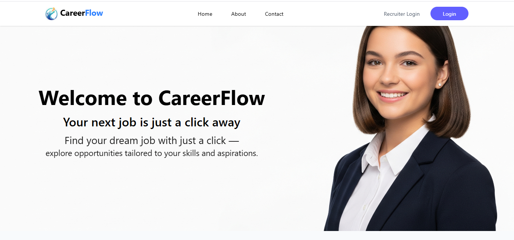
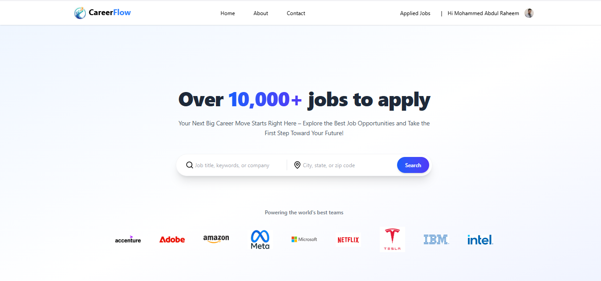
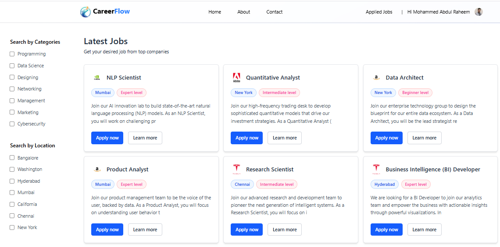
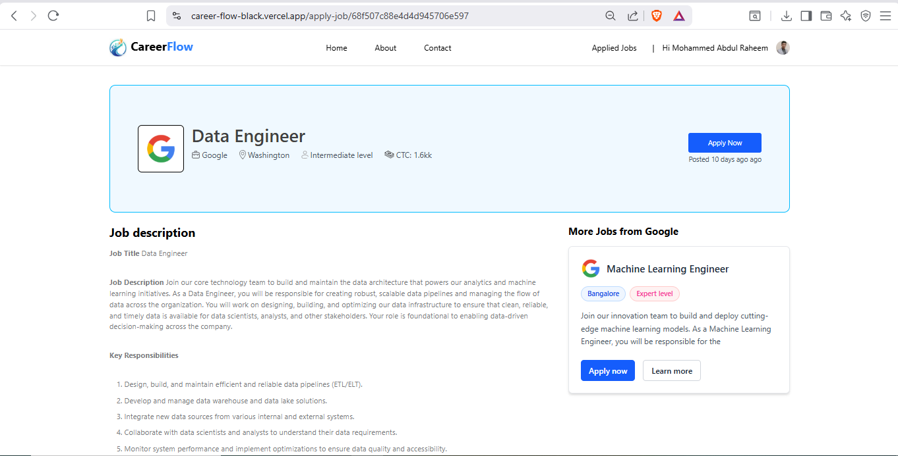
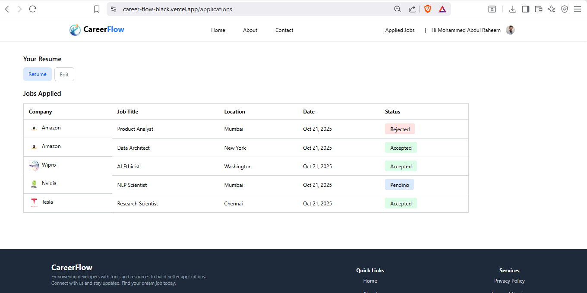
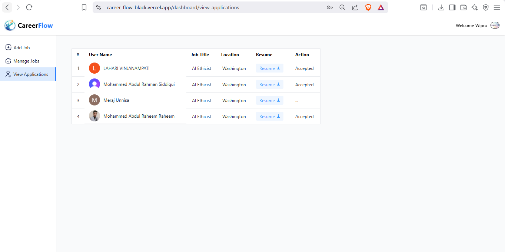
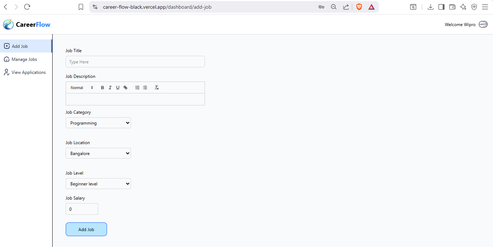
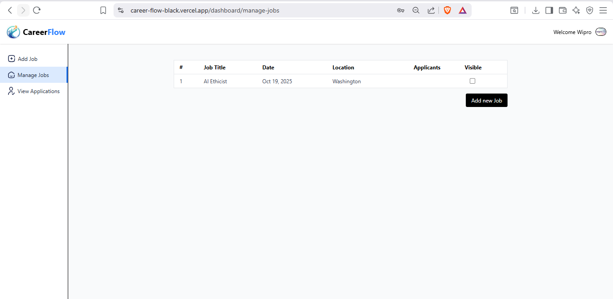

# CareerFlow — MERN Stack Job Application Platform 

 Deployement link: https://career-flow-black.vercel.app/

### Home Page

### Apply Job Page

### Applied Jobs Page

### Recruiter DashBoard

### Recruiter JobPosting

### Recruiter JobListing

This folder contains the frontend of CareerFlow — a web application that helps students discover jobs, apply to positions, and helps recruiters post and manage job listings. The frontend is built with modern web tooling and a component-based architecture to keep the UI fast, accessible, and easy to extend.

## What this project is

- A responsive application that lists jobs, shows job details, supports applications, and provides dashboard pages for recruiters and applicants.
- Built using a component-driven approach (see `src/components`) and a central app context (`src/context/AppContext.jsx`).

## Quick features

- Job listing and search
- Recruiter job posting and management
- Application submission and viewing
- Simple authentication flows wired to the backend

## 🛠 Tech Stack

**Frontend:**  
- React.js  
- Axios  
- Tailwind - CSS / Component-based Styling  

**Backend:**  
- Node.js  
- Express.js  
- Mongoose  
- Redis (for caching)  
- JWT (Authentication)  
- Cloudinary (Image Storage)   

**Database:**  
- MongoDB  

**Tools & Services:**  
- Postman (API Testing)  
- Vercel (Deployment with CI/CD)  

## -------- FRONTEND --------

1. Install dependencies:

   npm install

2. Start the dev server:

   npm run dev

3. Open the app in your browser (Vite will show the local URL, usually http://localhost:5173).

## -------- BACKEND --------
### Navigate to backend folder
cd backend

### Install dependencies
npm install

## Create a .env file in the root of the backend directory and include the following variable names

MONGO_DB_URI= 

PORT=

CLERK_WEB_HOOK=

CLOUDINARY_NAME=

CLOUDINARY_API_KEY=

CLOUDINARY_SECRET_KEY=

JWT_SECRET=

CLERK_PUBLISHABLE_KEY=

CLERK_SECRET_KEY=

## Start the backend server
npm run server

 The backend will typically run on http://localhost:5000 (or the port you define in .env)

## Contributing — we'd love your help!

Contributions are very welcome. If you'd like to help, please:

1. Fork the repository and create a feature branch.
2. Open a clear pull request describing what you changed and why.
3. Keep changes focused and include small, testable commits.

Whether it's fixing a bug, improving UI/UX, adding tests, or writing documentation — feel free to jump in. No contribution is too small. Be respectful, follow existing code style, and if you're uncertain about a change, open an issue or ask for feedback on your PR.

## Code of conduct

Please be respectful and constructive. Behave as you would in a professional open-source community.

## License

This project is open source — include a license at the repo root if not already present (for example, MIT).

Thanks for checking out CareerFlow — we look forward to your contributions!
